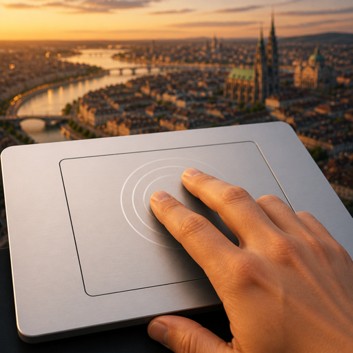

# Trackpad Camera Control

**Cities: Skylines I** mod for **trackpad** camera control — pan, orbit, and zoom via multitouch (pinch, two-finger), with hot-configurable Options.

> Status: **macOS v1** — Maps+ gestures (pan, pinch zoom, rotate, orbit) via in-process **AppKit** capture. Content Manager / Workshop title: **Trackpad Camera Control (macOS)**.
>
> **Implementation status:** macOS AppKit first. Windows / Linux backends are stubs. Contacts MultitouchSupport and CAD three-finger orbit remain **future / unfinished**. High-level design and Options are platform-neutral.



## Why this exists

CS1 camera orbit expects a middle mouse button. Trackpad players have asked for map-app-style gestures for years; no Workshop mod ships true multitouch camera control. Vanilla workarounds (Rotate Camera Modifier + OS middle-click tools) are partial. This project fills that gap.

## Getting started (macOS)

v1 is **macOS only**. Windows and Linux are unsupported.

1. Subscribe to [Cities Harmony](https://steamcommunity.com/sharedfiles/filedetails/?id=2040656402) and enable it.
2. Enable **Trackpad Camera Control (macOS)** in Content Manager (Workshop when published, or [local install](docs/developer/local-mvp-install.md)).
3. Load a city and click the game so it is focused.
4. Two-finger drag pans, pinch zooms, Option (`⌥`)+two-finger orbits. Tune Sensitivity in Options.

More: [Install and first run](docs/client/install-and-first-run.md). Harmony must be on or trackpad pan may fight vanilla zoom. [Skyve](https://steamcommunity.com/sharedfiles/filedetails/?id=2881031511) is optional and not required.

## Search keywords

`trackpad` · `touchpad` · `multitouch` · `pinch` · `camera` · `orbit` · `pan` · `zoom` · `gesture` · `laptop` · `mac` · `macos` · `macbook` · `Cities Skylines` · `CSL` · `middle mouse` · `mmb`

## Naming

| Surface                         | Name                                                                                                                  |
| ------------------------------- | --------------------------------------------------------------------------------------------------------------------- |
| Core display                    | **Trackpad Camera Control**                                                                                           |
| Workshop / Content Manager (v1) | **Trackpad Camera Control (macOS)** — temporary tag; see [Workshop storefront](docs/developer/workshop-storefront.md) |
| Repository                      | [`CSL-TrackpadCameraControl`](https://github.com/betsalel-williamson/CSL-TrackpadCameraControl)                       |
| Parallel                        | Named like [Joystick Camera Control](https://github.com/RenaKunisaki/CSL-JoystickCameraControl)                       |

## Shipped gestures (Maps+)

v1 ships **[Maps+](docs/glossary/maps-plus-preset.md)** only:

- Two-finger drag → pan
- Pinch → zoom
- Two-finger rotate → camera rotate (or place/relocate ghost)
- Option (`⌥`)+two-finger drag → orbit (macOS)

Feel (Slow / Default / Fast, Sensitivity) is hot-editable in Options — separate from which fingers map to which op. **CAD** three-finger orbit is a **future** gesture style (not a player choice in this release). A real mouse still works: wheel zoom and middle-mouse orbit stay vanilla alongside trackpad gestures.

## Docs

Sharded docs via [MDCP](https://github.com/betsalel-williamson/mdcp):

```bash
./scripts/bootstrap-dev.sh --install-tools   # Node, .NET tools, clang-format, npm, smoke checks
npm run docs          # compile + check (lint required)
npm run format:check  # csharpier + clang-format (see docs/developer/lint-and-format.md)
```

| Guide                   | Path                                                                                     |
| ----------------------- | ---------------------------------------------------------------------------------------- |
| Features / architecture | [`docs/features/`](docs/features/)                                                       |
| Player guide            | [`docs/client/`](docs/client/)                                                           |
| Contributor guide       | [`docs/developer/`](docs/developer/)                                                     |
| Community / marketing   | [`docs/developer/community-and-marketing.md`](docs/developer/community-and-marketing.md) |
| Workshop storefront     | [`docs/developer/workshop-storefront.md`](docs/developer/workshop-storefront.md)         |
| Release process         | [`docs/developer/release-process.md`](docs/developer/release-process.md)                 |
| Personas                | [`docs/client/personas.md`](docs/client/personas.md)                                     |
| Glossary                | [`docs/glossary/`](docs/glossary/)                                                       |

## Contributing

Solo-developed for now — please **[open an issue](https://github.com/betsalel-williamson/CSL-TrackpadCameraControl/issues)** before large PRs. See [CONTRIBUTING.md](CONTRIBUTING.md).

## Beta install

Download a [GitHub Release](https://github.com/betsalel-williamson/CSL-TrackpadCameraControl/releases) source archive, then [local MVP install](docs/developer/local-mvp-install.md) (`./scripts/install-mod-local.sh`).

## Prior art

Learns continuous-input patterns from [Joystick Camera Control](https://github.com/RenaKunisaki/CSL-JoystickCameraControl). This mod owns trackpad gesture input, not a full camera suite.

## Platform

- **Design / Options:** platform-neutral (shared gesture primitives + settings)
- **v1 backend:** macOS trackpad (in-process capture in the mod DLL)
- **Stubs:** Windows / Linux — same interface; contributions welcome

## License

MIT — see [LICENSE](LICENSE).

## Disclaimers and trademarks

This is an unofficial, fan-made project. It is **not** affiliated with, endorsed by, or sponsored by Paradox Interactive, Colossal Order, Apple Inc., Microsoft Corporation, or any other trademark holder.

- **Cities: Skylines** and related marks are trademarks or registered trademarks of Paradox Interactive AB and/or Colossal Order Ltd.
- **Mac**, **macOS**, **Magic Trackpad**, and related marks are trademarks of Apple Inc.
- **Windows** and related marks are trademarks of Microsoft Corporation.
- Other product names mentioned (for example Cities Harmony, Blender, Fusion) remain the property of their respective owners and are used only for identification or comparison.

Use of these names does not imply any relationship with or endorsement by the trademark holders. Cities: Skylines is required to use this mod and must be obtained separately through legitimate channels.
