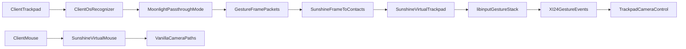

# Remote streaming gestures (Sunshine / Moonlight)

## Intent

Make trackpad camera control work when the player is on a laptop or iPad **streaming** Cities: Skylines I from another machine — without inventing a second capture architecture. The target shape: the streaming host ends up with a real [indirect touch device](../glossary/indirect-touch-device.md), so the [Linux gesture backend](./linux-gesture-backend.md) is the only backend the mod ever needs.

Upstream state below was read at Sunshine `307a608`, libvirtualhid `3636008`, moonlight-qt `e3fd29e`, moonlight-common-c `62e0663` (all 2026-09).

## Why gestures die today

Three independent collapses, one per surface.

| #   | Surface  | Where it collapses                                                                                                                                                                                                                                                                                                                                                                                      |
| --- | -------- | ------------------------------------------------------------------------------------------------------------------------------------------------------------------------------------------------------------------------------------------------------------------------------------------------------------------------------------------------------------------------------------------------------- |
| 1   | Client   | moonlight-qt drops every non-touchscreen contact: `SdlInputHandler::handleTouchFingerEvent` returns early when `SDL_GetTouchDeviceType() != SDL_TOUCH_DEVICE_DIRECT`, commented "we want to handle those in the mouse path". On macOS SDL2 _already_ reports the trackpad as `SDL_TOUCH_DEVICE_INDIRECT_ABSOLUTE` with per-finger `NSTouch.normalizedPosition` — the contacts exist and are thrown away |
| 2   | Protocol | `LiSendTouchEvent` models a **touchscreen**: `SS_TOUCH_PACKET` carries `pointerId`, `x`, `y`, pressure, contact ellipse, rotation — with x/y "normalized device coordinates … of the video area". There is no device-kind field and no notion of an indirect surface                                                                                                                                    |
| 3   | Host     | Sunshine injects those contacts into a **touchscreen** (`lvh::Touchscreen`, `INPUT_PROP_DIRECT`). libinput gives touchscreens **no** gesture interpretation — pinch and swipe exist only for touchpads. So even a perfect contact stream produces zero gestures on a Linux host                                                                                                                         |

## The load-bearing finding

`libvirtualhid` — the device library Sunshine vendors — **already implements a virtual trackpad** and Sunshine never creates one.

- `lvh::Trackpad`, `lvh::profiles::trackpad()`, `Runtime::create_trackpad()`, and a `supports_trackpad` capability all exist.
- Its Linux uinput setup (`configure_evdev_trackpad`) declares `INPUT_PROP_POINTER` + `INPUT_PROP_BUTTONPAD`, MT protocol B with 16 slots, `ABS_MT_POSITION_X/Y`, `ABS_MT_TRACKING_ID`, `ABS_MT_PRESSURE`, `ABS_MT_ORIENTATION`, and `BTN_TOOL_FINGER` through `BTN_TOOL_QUINTTAP` — i.e. a device libinput will classify as a touchpad and run its gesture stack on.
- Sunshine's per-client `client_context_t` constructs only `Touchscreen` (gated on `supports_touchscreen`) and `PenTablet`. `create_trackpad` appears nowhere in `Sunshine/src`.

So the host-side work is **wiring, not invention**: one more device plus a routing switch next to the existing `native_pen_touch` config. Axis resolution is the one gap — the profile declares ranges (19200x10800) with resolution 0, so libinput falls back to a default ~69x55 mm size; ship a libinput quirks entry (`MatchName=libvirtualhid Trackpad`, `AttrResolutionHint`/`AttrSizeHint`) or set resolution in the profile.

## Recommended pipeline

**Send the frame, not the contacts.** The client already has a recognized gesture — AppKit `magnify` / `rotate` / `scroll` on macOS, UIKit recognizers on iPadOS, libinput gestures on a Linux client — and that recognition is the UX we ship. Forwarding contacts instead throws it away and asks libinput to re-derive it from a synthetic pad, which is how a known-good frame turns back into a tuning project.

The host can have both. libinput computes `scale = distance / initial_distance` and `angle = atan2(dy, dx)` over the two gesture touches, so two contacts placed at `center +/- (r0 * scale / 2) * (cos A, sin A)` are the **analytic inverse** of a frame: libinput recovers the same scale and angle delta, to device-unit quantization. A Sunshine-side synthesizer therefore turns a frame back into a real touchpad event stream with no heuristics, and — the part that matters for feel — it can place the contacts so libinput enters `PINCH` immediately instead of walking its scroll-then-correct path.

Raw contact passthrough stays worth having, because it serves every multitouch app rather than this one and is the easier upstream ask, but it is the complement, not the primary.

## Work shards

| Shard                 | Owner                    | Change                                                                                                                                                                                                      |
| --------------------- | ------------------------ | ----------------------------------------------------------------------------------------------------------------------------------------------------------------------------------------------------------- |
| **S1 Host device**    | Sunshine                 | Create `lvh::Trackpad` per client; route touch packets to it when the client declares an indirect surface. Advertise it in `platf::get_capabilities()` beside `pen_touch`                                   |
| **S2 Host quirks**    | Sunshine / libvirtualhid | Declare axis resolution, or ship a libinput quirks file, so gesture thresholds and pointer accel are computed against a sane physical size                                                                  |
| **S3 Wire**           | moonlight-common-c       | Carry device kind (direct vs indirect) on touch events and gate it behind a new host feature flag. `LI_FF_PEN_TOUCH_EVENTS` is `0x01` and controller touch is `0x02`, so the next bit is free on both sides |
| **S4 Client capture** | moonlight-qt             | Route `SDL_TOUCH_DEVICE_INDIRECT_ABSOLUTE` into a passthrough handler instead of `return`. macOS works first because SDL2 already surfaces those contacts                                                   |
| **S5 Client de-dupe** | moonlight-qt             | While passthrough is live, stop sending mouse motion synthesized from the same physical pad, or the host sees the gesture **and** the collapsed pointer move                                                |
| **S6 Mod**            | us                       | [Linux gesture backend](./linux-gesture-backend.md). Nothing streaming-specific                                                                                                                             |
| **S7 Fallback**       | Moonlight / Sunshine     | Clients that only get semantic gestures (iPadOS) send a gesture frame; Sunshine synthesizes contacts onto the same virtual trackpad                                                                         |

**Settle the fidelity question before writing any of it.** The decisive experiment needs no client, no protocol change, and no fork: a local harness that creates a uinput trackpad, replays recorded frames through the S4 synthesis, and reads back what libinput reports. Frames in, frames out, compared. Our existing session capture logs (`TRACKPAD_CAPTURE_LOG`) are already the corpus — real macOS gestures from real playtests — which makes this a regression test rather than a one-off spike.

If round-tripping holds, S3-S6 are worth asking upstream for. If it does not, that is the cheapest possible place to learn it.

## What the mod must not do

- **Do not** add a streaming-mode backend, a Sunshine detector, or a "disable the mouse frame" toggle. Once the host exposes a touchpad, the mod attributes by source device exactly as it does for a physical pad, and vanilla wheel/middle-mouse stay on the mouse device. A product-visible streaming switch would be a second code path that playtesting cannot cover.
- **Do not** reintroduce an IPC/socket bridge to receive gestures out-of-band — [ADR 0001](./adr/0001-native-multitouch-bridge.md) retired that, and the host-device route removes the reason for it.

## Edge cases

| Case                                        | Resolution                                                                                                                                                                                                                                                                                        |
| ------------------------------------------- | ------------------------------------------------------------------------------------------------------------------------------------------------------------------------------------------------------------------------------------------------------------------------------------------------- |
| **iPad with a mouse or trackpad attached**  | iPadOS hands an app _indirect pointer_ events and semantic recognizers for an attached pad, not raw contacts — S4 cannot work there, so that client needs S7. A mouse attached alongside remains a separate stream and lands on Sunshine's virtual mouse: the mod ignores it, vanilla consumes it |
| Client pad drives both gestures and pointer | S5. Suppress pad-sourced pointer motion while contacts are live, with a short release hysteresis                                                                                                                                                                                                  |
| Relative-mouse / pointer-lock capture       | Streaming clients capture the cursor for games; confirm passthrough contacts still flow in that mode and that the host cursor does not jump                                                                                                                                                       |
| Two clients, or client + local pad          | Sunshine builds devices per client, so the host can see several touchpads. Source-device attribution handles it; no mod state is per-device                                                                                                                                                       |
| Latency                                     | Gestures are recognized twice (client pad → contacts → libinput). Budget it in playtesting; prefer raw contacts precisely to keep one recognizer in the chain                                                                                                                                     |
| Host is Windows or macOS                    | Out of scope here: Windows already lands native touch through the Synthetic Pointer API, and Sunshine's macOS backend reports no touch support                                                                                                                                                    |

## Acceptance

- A Linux host streaming to a macOS Moonlight client pans, zooms, and rotates the CS1 camera from the client trackpad, with wheel zoom and middle-mouse orbit still vanilla from a plugged-in mouse.
- The mod ships exactly one Linux `IGestureSource`, with no streaming branch in resolve, settings, or Options.
- Frame round-trip fidelity is proven by the replay harness against real capture logs before any upstream ask is filed, and each ask (S1-S6) stands alone.
