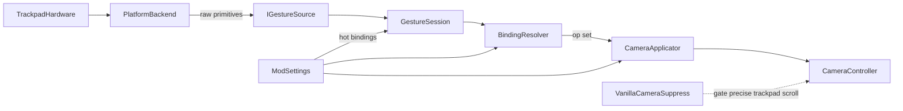

# System architecture

## End-user value

Players feel map-app-like or CAD-like trackpad control inside Cities: Skylines I without buying a mouse, while bindings and feel stay fully tunable for experimentation. Optional Debug chrome can drive the same camera ops for tuning and pipeline validation when `EnableAssistChrome` is on.

## Context

## Components

| Component               | Responsibility                                                                                                                                                                                             |
| ----------------------- | ---------------------------------------------------------------------------------------------------------------------------------------------------------------------------------------------------------- |
| Platform backend        | Capture OS trackpad contacts / gestures; arm/connect on city load; emit raw primitives while the game is focused                                                                                           |
| Gesture source          | Deliver primitives into the mod from in-process capture (Contacts or AppleGestures); see ADR 0001                                                                                                          |
| Gesture session         | Orbit latch and resolve-mode state across frames                                                                                                                                                           |
| Binding resolver        | Map primitives + session state to a camera **op set** (pan / zoom / yaw / orbit flags)                                                                                                                     |
| Camera applicator       | Apply each enabled op to size, target position, and angles using live settings                                                                                                                             |
| Debug UI                | Floating Debug panel for feel tunables; optional chrome emits the same camera ops as gestures when flagged on                                                                                              |
| CS1 mod                 | CitiesHarmony-hosted C#; resolve primitives through live settings; write camera targets                                                                                                                    |
| Vanilla camera suppress | Harmony gate while the mod is on: skip vanilla scroll-zoom from precise trackpad; keep mouse wheel, middle-mouse orbit, edge/keyboard/gamepad. See [vanilla camera suppress](./vanilla-camera-suppress.md) |
| ModSettings             | Single source of truth for presets, bindings, Debug UI enable, and feel; hot-applied                                                                                                                       |
| Unsupported backends    | Same interface; report unsupported                                                                                                                                                                         |

Platform-specific capture details (for example the first macOS backend) live in [platform backends](./platform-backends.md) and ADR 0001 — not in this high-level picture.

## Data flow

1. Backend emits finger count, centroid delta, pinch scale, rotate delta, and modifier flags.
2. Gesture session updates [orbit latch](../glossary/orbit-latch.md) and resolve-mode session state.
3. Binding resolver maps primitives to a camera **op set** using the live binding table and session.
4. Optional [Debug UI](./debug-ui-camera-chrome.md) emits the same camera ops from chrome controls when `EnableAssistChrome` is on.
5. Applicator applies each op in the set to camera target position, angle, and size with settings-driven [drag scale](../glossary/drag-scale.md) / [sensitivity](../glossary/sensitivity.md), [button step](../glossary/button-step.md) for chrome nudges, invert, deadzone, pan city-bounds clamp, and optional [low-pass](../glossary/low-pass.md) (see [apply math](./settings-and-hot-configuration.md#apply-math-contract)). Selection-aware rotate / orbit: [selection-aware gestures](./selection-aware-gestures.md).
6. While the mod is enabled, [vanilla camera suppress](./vanilla-camera-suppress.md) skips vanilla scroll-zoom from precise trackpad so that path does not fight gesture writes. Mouse wheel, middle-mouse orbit, edge pan, keyboard, and gamepad still reach the camera.
7. One-finger pointer path is left to the game (outside Debug chrome).

## Lifecycle (enable → load → tick)

1. **Content Manager enable** — `Mod.OnEnabled`: settings load, `ModRuntime` + default capture source, Harmony patches apply.
2. **City load** — `LoadingExtension.OnLevelLoaded`: boot focus activation; **arm gesture capture** for the loaded scene (independent of Debug UI).
3. **Simulation tick** — `GestureThreading.OnUpdate`: `GesturePipeline.Tick()` syncs input gates, connects capture if needed, resolves primitives, applies camera ops.
4. **Debug UI** — optional; `TuningPanelHost.EnsureCreated()` is for the floating panel only and does not gate capture readiness.

## Constraints

- Prefer additive camera writes. The Harmony gate is limited to vanilla scroll-zoom from precise trackpad while the mod is on.
- Do not own zoom-limit or saved-position features.
- Fail soft if a backend is missing or fails to start, and if Cities Harmony is missing (gestures may still apply; scroll fight may remain).
- Interpretation stays in C# so feel changes never require restarting the backend.

## Open risks

- OS-reserved multi-finger gestures vs CAD three-finger orbit (varies by platform).
- Cities Harmony missing or failing to patch: two-finger pan may still overlap vanilla scroll-zoom.
- Backend ABI or driver differences across OS versions.
