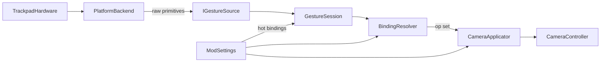

# System architecture

## End-user value

Players feel map-app-like or CAD-like trackpad control inside Cities: Skylines I without buying a mouse, while bindings and feel stay fully tunable for experimentation. Optional Assist UI chrome can drive the same camera ops for assist and pipeline validation (Assist UI ships in a later phase).

## Context

## Components

| Component            | Responsibility                                                                                          |
| -------------------- | ------------------------------------------------------------------------------------------------------- |
| Platform backend     | Capture OS trackpad contacts / gestures; emit raw primitives while the game is focused                  |
| Gesture source       | Deliver primitives into the mod — IPC helper (**dev**) or in-process capture (**deploy**); see ADR 0001 |
| Gesture session      | Orbit latch and resolve-mode state across frames                                                        |
| Binding resolver     | Map primitives + session state to a camera **op set** (pan / zoom / yaw / orbit flags)                  |
| Camera applicator    | Apply each enabled op to size, target position, and angles using live settings                          |
| Assist UI            | Optional on-screen chrome; emits the same camera ops as gestures; style follows Gesture preset          |
| CS1 mod              | CitiesHarmony-hosted C#; resolve primitives through live settings; write camera targets                 |
| ModSettings          | Single source of truth for presets, bindings, Assist UI enable, and feel; hot-applied                   |
| Unsupported backends | Same interface; report unsupported                                                                      |

Platform-specific capture details (for example the first macOS backend) live in [platform backends](./platform-backends.md) and ADR 0001 — not in this high-level picture.

## Data flow

1. Backend emits finger count, centroid delta, pinch scale, rotate delta, and modifier flags.
2. Gesture session updates [orbit latch](../glossary/orbit-latch.md) and resolve-mode session state.
3. Binding resolver maps primitives to a camera **op set** using the live binding table and session.
4. Optional [Assist UI](./assist-ui-camera-chrome.md) emits the same camera ops from chrome controls (later phase).
5. Applicator applies each op in the set to camera target position, angle, and size with settings-driven sensitivity, invert, deadzone, and smoothing.
6. One-finger pointer path is left to the game (outside Assist UI chrome).

## Constraints

- Prefer additive camera writes over heavy Harmony patches (optional vanilla-camera gate is a later phase).
- Coexist with ACME; do not own zoom-limit or saved-position features.
- Fail soft if a backend is missing or fails to start.
- Interpretation stays in C# so feel changes never require restarting the backend.

## Open risks

- OS-reserved multi-finger gestures vs CAD three-finger orbit (varies by platform).
- Two-finger pan overlapping system scroll.
- Backend ABI or driver differences across OS versions.
