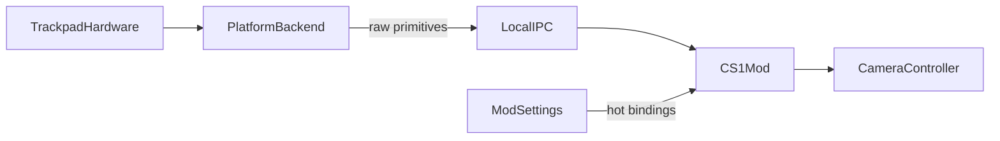

# System architecture

## End-user value

Players feel map-app-like or CAD-like trackpad control inside Cities: Skylines I without buying a mouse, while Options stay fully tunable for experimentation.

## Context

## Components

| Component | Responsibility |
| --- | --- |
| Platform backend | Capture OS trackpad contacts / gestures; stream raw primitives while the game is focused |
| IPC | Bounded local transport of primitives (not camera ops) |
| CS1 mod | CitiesHarmony-hosted C#; resolve primitives through live settings; write camera targets |
| ModSettings | Single source of truth for presets, bindings, and feel; hot-applied |
| Unsupported backends | Same interface; report unsupported |

Platform-specific capture details (for example the first macOS backend) live in [platform backends](./platform-backends.md) and ADR 0001 — not in this high-level picture.

## Data flow

1. Backend emits finger count, centroid delta, pinch scale, rotate delta, and modifier flags.
2. Mod maps primitives to camera ops using the live binding table.
3. Mod applies deltas to camera target position, angle, and size with settings-driven sensitivity, invert, deadzone, and smoothing.
4. One-finger pointer path is left to the game.

## Constraints

- Prefer additive camera writes over heavy Harmony patches.
- Coexist with ACME; do not own zoom-limit or saved-position features.
- Fail soft if a backend is missing or fails to start.
- Interpretation stays in C# so Options never require restarting the backend for feel changes.

## Open risks

- OS-reserved multi-finger gestures vs CAD three-finger orbit (varies by platform).
- Two-finger pan overlapping system scroll.
- Backend ABI or driver differences across OS versions.
