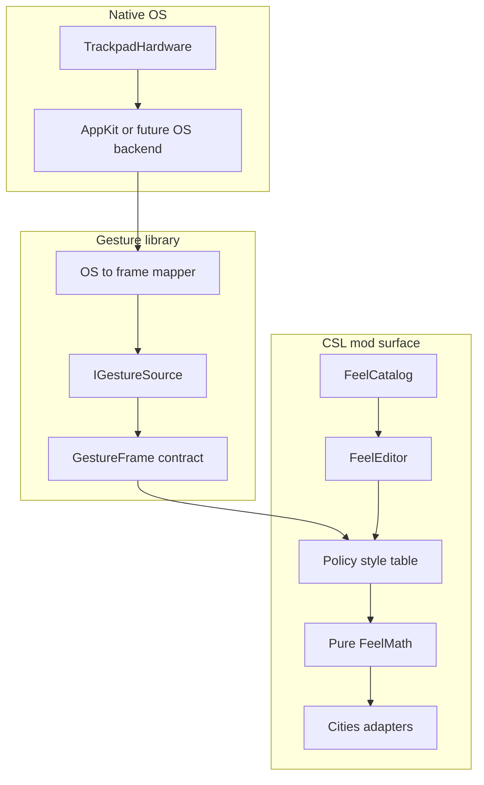

# Under the hood

## Purpose

The rewrite is a **new under-the-hood implementation** of Trackpad Camera Control. Players still see the shipping Maps+ feel surface ([UI parity](../glossary/ui-parity.md), [parity with shipping](./parity-with-shipping.md)). Maintainers get a simpler system: fewer concepts, clear layer boundaries, and seams that extend without forking the product.

This is not a copy of shipping C# ([ADR 0005](./adr/0005-ux-parity-not-source-parity.md)). Shipping `mod/` is an oracle for labels, layout rhythm, numeric defaults, and Maps+ outcomes — not a paste buffer.

## Three stack layers

| Layer                                                 | Owns                                                                                                                                       | Must not own                                                                   |
| ----------------------------------------------------- | ------------------------------------------------------------------------------------------------------------------------------------------ | ------------------------------------------------------------------------------ |
| **Native OS**                                         | Trackpad / HID / AppKit (or future OS) event sampling                                                                                      | Pan/zoom/orbit meaning, feel UI, Cities types                                  |
| **[Gesture library](../glossary/gesture-library.md)** | Shared primitive frame, backend interface, OS→frame mappers                                                                                | CSL Options/Debug, Maps+ seeds, ColossalUI, Cities Harmony, `CameraController` |
| **[Mod surface](../glossary/mod-surface.md)**         | Style table + Maps+ seed, [feel catalog](./feel-catalog.md)/editor/store, Options/Debug hosts, Policy, FeelMath + Cities adapters, Harmony | AppKit P/Invoke; a second frame contract                                       |

Tick planes (Capture → Policy → Apply) describe **one CSL simulation tick**. Capture’s _implementation_ lives in the gesture library; Policy, Apply, and feel UI live on the mod surface. Feel Options and Debug are **not** a fourth tick plane — they are two hosts over one catalog and one editor.

## Import matrix (non-overlapping)

Each layer’s code imports and assembly references must not pull concerns from another layer. Overlap is a design smell — split until single responsibility holds.

| Unit                                              | May reference                                     | Must not reference                                     |
| ------------------------------------------------- | ------------------------------------------------- | ------------------------------------------------------ |
| Native / AppKit backend                           | OS APIs (P/Invoke, AppKit)                        | UnityEngine, ICities, Colossal, Harmony, Feel/Policy   |
| Gesture library core (frame + source interface)   | Pure contracts only                               | Cities; Feel UI; OS P/Invoke in the same type as Unity |
| Optional Unity-engine bridge in library           | UnityEngine only (game-agnostic)                  | ICities, Colossal, Harmony, CSL Feel/Maps+             |
| CSL pure Policy / FeelMath / FeelEditor / catalog | Library frame + mod settings                      | UnityEngine, ICities, Colossal, AppKit, Harmony        |
| CSL Cities adapters / Host / Patcher / UI hosts   | Library + game/engine DLLs as needed **per file** | AppKit P/Invoke                                        |

Automated evidence: layer-import lint under static analysis. Library csproj never lists Cities managed DLLs.

## Tests and fakes

| Test kind              | Proves                                                | Fake stands in for                                       |
| ---------------------- | ----------------------------------------------------- | -------------------------------------------------------- |
| Unit (library)         | Frame contract, mapper math, inject seam              | **OS only**                                              |
| Unit (mod pure)        | Style resolve, session, FeelMath, FeelEditor, catalog | **Game ports only** (camera, selection, in-memory store) |
| Unit (UI host mapping) | Catalog → control descriptors                         | **UI toolkit port only**                                 |
| Integration (pipeline) | Gates → source → resolve → FeelMath → adapter         | One fake **per** external subsystem                      |
| In-game (tier C)       | Real OS + Unity + CSL                                 | No fakes                                                 |

A fake simulates **one** subsystem (operating system, Unity engine, or video-game libraries). Name it that way. A type that fakes two layers fails the design until split. Developer guide _Harnesses and testing_ holds the fake-per-layer table.

## Unit map (mod surface)

| Unit                  | Job                                                                       |
| --------------------- | ------------------------------------------------------------------------- |
| Feel catalog          | Ordered sections and fields: id, player label, control kind               |
| Feel editor           | Preset dirty model, Sensitivity writes, one dirty bit, coalesced autosave |
| Settings store        | Schema v1 XML load/flush                                                  |
| Options host          | Catalog → native Options groups                                           |
| Debug host            | Catalog → floating panel chrome                                           |
| Style table + resolve | Chord → op from Maps+ seed rows                                           |
| FeelMath              | Pure op + feel → camera/selection deltas (no Unity)                       |
| Cities adapters       | Thin read/write of game camera and selection                              |
| Harmony               | Precise-trackpad scroll suppress; deferred orbit flush                    |

## Extension seams

- New OS backend → another source in the gesture library.
- New Unity title → new mod referencing the same library.
- New feel field → catalog row + editor bind + FeelMath consumer.
- New gesture style → seed rows behind a compile-omit module.
- Assist chrome → compile-omitted module, not a second Debug product.

## Rejected paths

- Clone-and-strip of shipping sources (closed).
- Capture trapped inside the CSL DLL with AppKit P/Invoke beside Cities types.
- Two parallel Options/Debug product definitions.
- Overlapping DLL imports across layers.
- God-fakes that pretend to be OS + Unity + Cities at once.

## Related

- [System architecture](./system-architecture.md) — tick contract
- [Feel catalog](./feel-catalog.md) — player surface inventory
- [ADR 0006](./adr/0006-gesture-library-vs-mod-surface.md) — library vs mod decision
- [Greenfield redesign lessons](./greenfield-redesign-lessons.md) (L1–L13)
