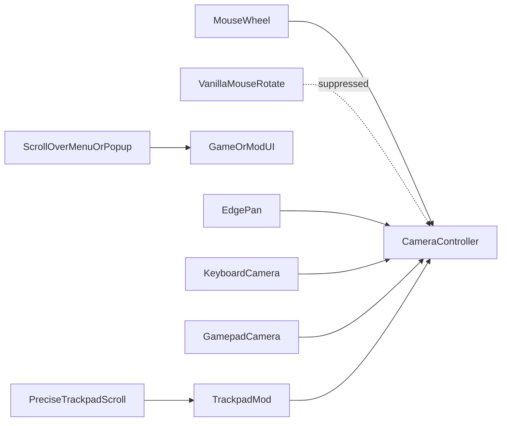

# Suppress vanilla camera input

## Intent

While Trackpad Camera Control is enabled, stop overlapping vanilla camera paths from fighting trackpad ops — without blocking mouse-wheel zoom, menu scrolling, or popup UI gestures. Classic Cities: Skylines I **edge pan**, **keyboard** camera keys, and **gamepad** camera remain. Disable the mod to restore full vanilla camera input.

There is no Options checkbox for this; mod on/off is the switch. Cities Harmony is required for suppress patches to apply.

## End-user outcomes

- Precise trackpad two-finger scroll [pans](../glossary/pan.md) without also vanilla-zooming.
- Real mouse wheel still vanilla-zooms.
- Options / other menus open: two-finger scrolls the UI; the city does not pan from the mod.
- Cursor over any active popup (Debug panel or other mods): two-finger scrolls/drags UI, not camera; keyboard may still move the camera unless a text field is focused.
- Mouse-drag vanilla camera rotate does not run while the rotate-camera binding is held and the mod is on.
- Edge scrolling, keyboard move/rotate/zoom, and analog/gamepad camera still work.
- One-finger tools stay with the game.
- [Cities Harmony](https://steamcommunity.com/sharedfiles/filedetails/?id=2040656402) is required for suppress. If Harmony is missing, the mod still enables; pan may fight vanilla scroll-zoom until Harmony is present.

## Policy while the mod is enabled

| Vanilla path | Action |
| ------------ | ------ |
| Scroll-zoom from **precise trackpad** scroll (world, gates clear) | Suppress |
| Scroll-zoom from **mouse wheel** | Keep |
| Scroll when **menu/Options open** or **pointer over popup** | Keep (UI scroll); mod does not apply camera |
| Mouse-drag camera rotate (binding on) | Suppress |
| Edge scrolling | Keep |
| Keyboard camera keys | Keep |
| Gamepad / analog | Keep |
| Free-cam / follow / override | Keep |
| One-finger tools / UI | Keep |

## Relationship to the gesture pipeline

[Vanilla camera suppress](../glossary/vanilla-camera-suppress.md) is a **gate in front of vanilla camera input**, not a replacement for [trackpad camera](./trackpad-camera.md) apply. Menu-open and over-popup gates skip mod apply and leave scroll available to UI. Device split uses precise vs non-precise scrolling deltas.

## Acceptance

- World + focused: two-finger pan does not also vanilla-zoom; mouse wheel zooms.
- Options open: two-finger scrolls Options; city does not pan from the mod.
- Cursor over Assist or another popup: two-finger does not pan the city.
- Holding the vanilla rotate-camera mouse binding does not mouse-drag-rotate while the mod is on.
- Edge pan, keyboard, and gamepad still move the camera.
- Disabling the mod restores full vanilla scroll-zoom and mouse-drag rotate.
- Missing Cities Harmony: mod enables without crashing; scroll fight may remain.

## Non-goals

- An Options UI checkbox to leave vanilla camera on while the mod is enabled.
- Suppressing keyboard camera, edge pan, free-cam, follow, or gamepad.
- Perfect keyboard-vs-popup arbitration beyond not stealing focused text fields.
