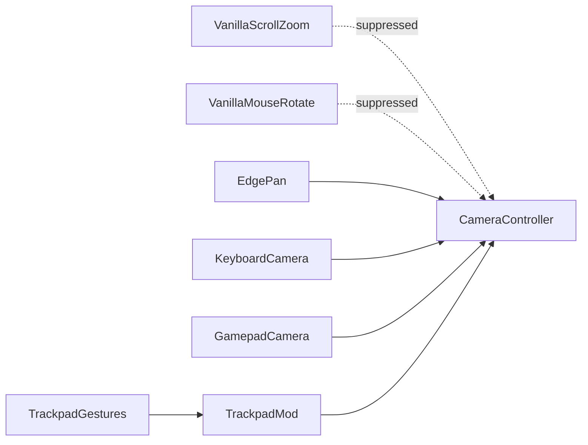

# Suppress vanilla camera input

## Intent

While Trackpad Camera Control is enabled, stop vanilla scroll-zoom and mouse-drag camera rotate from fighting [pan](../glossary/pan.md) and other trackpad camera ops. Classic Cities: Skylines I **edge pan**, **keyboard** camera keys, and **gamepad** camera remain. Disable the mod to restore full vanilla camera input.

There is no Options checkbox for this; mod on/off is the switch.

## End-user outcomes

- Two-finger pan feels like Maps+/CAD: the camera slides without Unity scroll-zoom also firing.
- Mouse-drag vanilla camera rotate does not run while the rotate-camera binding is held and the mod is on.
- Edge scrolling, keyboard move/rotate/zoom, and analog/gamepad camera still work.
- One-finger tools and UI stay with the game.
- Free-cam, follow, and other camera overrides the game already owns stay untouched.
- [Cities Harmony](https://steamcommunity.com/sharedfiles/filedetails/?id=2040656402) is required for suppress to apply. If Harmony is missing, the mod still enables and gestures still apply, but pan may fight vanilla scroll-zoom until Harmony is subscribed and the mod is re-enabled.

## Policy while the mod is enabled

| Vanilla path                          | Action   |
| ------------------------------------- | -------- |
| Scroll-zoom                           | Suppress |
| Mouse-drag camera rotate (binding on) | Suppress |
| Edge scrolling                        | Keep     |
| Keyboard camera keys                  | Keep     |
| Gamepad / analog                      | Keep     |
| Free-cam / follow / override          | Keep     |
| One-finger tools / UI                 | Keep     |

## Relationship to the gesture pipeline

[Vanilla camera suppress](../glossary/vanilla-camera-suppress.md) is a **gate in front of vanilla camera input**, not a replacement for [trackpad camera](./trackpad-camera.md) apply. Gestures still write camera targets through the existing pipeline. Suppress only prevents the overlapping vanilla scroll and mouse-rotate paths from also writing the camera in the same session.

## Acceptance

- With the mod enabled, Cities Harmony present, and the game focused, two-finger pan does not also zoom via vanilla scroll.
- With the mod enabled, holding the vanilla rotate-camera mouse binding does not mouse-drag-rotate the camera.
- Edge pan still moves the camera when the cursor is at the screen edge and the rotate-camera binding is **not** held.
- Keyboard camera keys still move, rotate, and zoom.
- Gamepad / analog camera still works.
- One-finger click and drag still drive tools and UI.
- Disabling the mod restores vanilla scroll-zoom and mouse-drag rotate.
- If Cities Harmony is not installed, the mod enables without crashing; gestures may still apply; vanilla scroll-zoom may still fight pan.

## Non-goals

- An Options UI checkbox to leave vanilla camera on while the mod is enabled.
- Suppressing keyboard camera, edge pan, free-cam, follow, or gamepad.
- Owning ACME camera-suite behavior beyond not breaking keyboard and edge pan.
