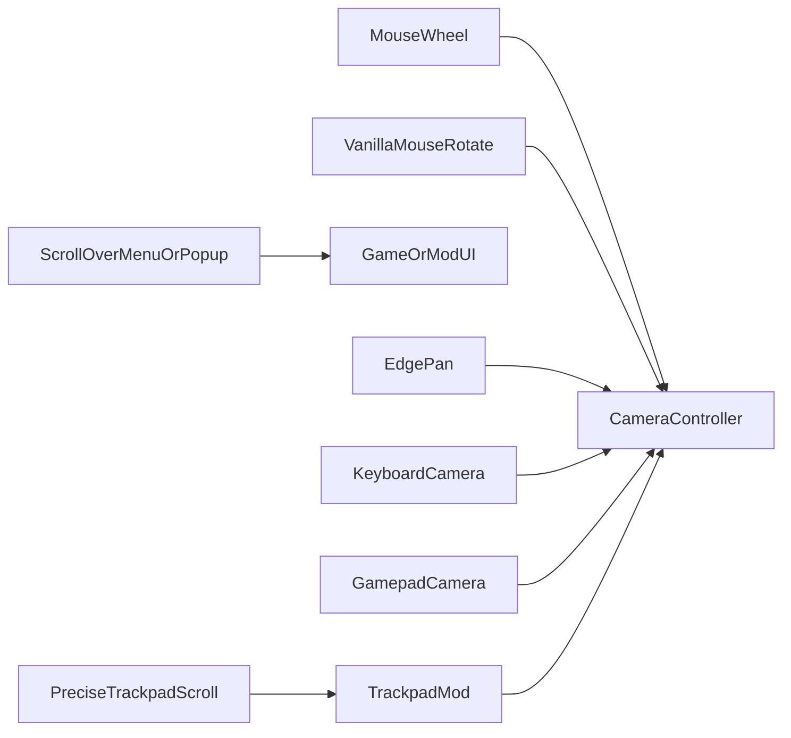

# Suppress vanilla camera input

## Intent

While Trackpad Camera Control is enabled, stop overlapping vanilla camera paths from fighting trackpad ops — without blocking **physical middle-mouse orbit**, mouse-wheel zoom, menu scrolling, or popup UI gestures. Classic Cities: Skylines I **edge pan**, **keyboard** camera keys, and **gamepad** camera remain. Disable the mod to restore full vanilla camera input.

There is no Options checkbox for this; mod on/off is the switch. Cities Harmony is required for suppress patches to apply.

Harmony scope in the rewrite is **narrow**: precise-trackpad scroll suppress buffers, and deferred Option-orbit velocity flush after vanilla damp. Harmony must not statically cache focus, menu, over-UI, selection, or camera pose ([system architecture](./system-architecture.md)).

## End-user outcomes

- Precise trackpad two-finger scroll pans without also vanilla-zooming.
- Real mouse wheel still vanilla-zooms.
- Options / other menus open: two-finger scrolls the UI; the city does not pan from the mod.
- Cursor over any active popup (Debug panel or other mods): two-finger scrolls/drags UI, not camera; keyboard may still move the camera unless a text field is focused.
- **Middle-mouse drag orbit** (rotate-camera binding) still runs vanilla while the mod is on; trackpad gestures use separate paths.
- Edge scrolling, keyboard move/rotate/zoom, and analog/gamepad camera still work.
- One-finger tools stay with the game.
- Cities Harmony is required for suppress and orbit flush. If Harmony is missing, the mod still enables; pan may fight vanilla scroll-zoom and Option-orbit may not integrate until Harmony is present.

## Policy while the mod is enabled

| Vanilla path                                                      | Action                                      |
| ----------------------------------------------------------------- | ------------------------------------------- |
| Scroll-zoom from **precise trackpad** scroll (world, gates clear) | Suppress                                    |
| Scroll-zoom from **mouse wheel**                                  | Keep                                        |
| Scroll when **menu/Options open** or **pointer over popup**       | Keep (UI scroll); mod does not apply camera |
| Mouse-drag camera rotate (rotate binding held)                    | Keep                                        |
| Edge scrolling                                                    | Keep                                        |
| Keyboard camera keys                                              | Keep                                        |
| Gamepad / analog                                                  | Keep                                        |
| Free-cam / follow / override                                      | Keep                                        |
| One-finger tools / UI                                             | Keep                                        |

## Relationship to the gesture pipeline

Vanilla camera suppress is a **gate in front of vanilla camera input**, not a replacement for [trackpad camera](./trackpad-camera.md) Apply. Menu-open and over-popup gates skip mod Apply and leave scroll available to UI. Device split uses precise vs non-precise scrolling deltas.

Harmony reads **frame buffers** for precise-trackpad scroll and menu/over-UI — not persisted settings. Policy re-queries those conditions each tick and publishes buffers for the patch.

Trackpad Option-orbit still flushes pending angle velocity from a Harmony **postfix** after vanilla inertia damp and before integrate — the same slot middle-mouse drag uses. The prefix does not skip vanilla middle-mouse drag.

## Acceptance

- World + focused: two-finger pan does not also vanilla-zoom; mouse wheel zooms.
- Options open: two-finger scrolls Options; city does not pan from the mod.
- Cursor over Debug or another popup: two-finger does not pan the city.
- Holding the vanilla rotate-camera mouse binding still middle-mouse-orbits while the mod is on.
- Trackpad pan/zoom/orbit and middle-mouse orbit can be used in the same session without disabling the mod.
- Edge pan, keyboard, and gamepad still move the camera.
- Disabling the mod restores full vanilla scroll-zoom.
- Missing Cities Harmony: mod enables without crashing; scroll fight and missing orbit flush may remain.
- No Harmony patches beyond suppress buffers and orbit velocity flush on the ship surface.

## Non-goals

- An Options UI checkbox to leave vanilla camera on while the mod is enabled.
- Suppressing keyboard camera, edge pan, free-cam, follow, or gamepad.
- Perfect keyboard-vs-popup arbitration beyond not stealing focused text fields.
- Using Harmony to own focus, selection, or camera pose state across ticks.
