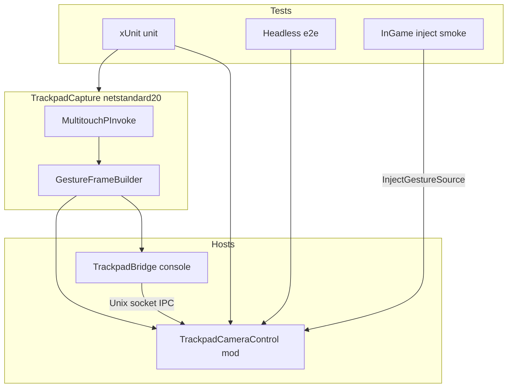

# C# capture, tests, and e2e harnesses — Design

**Date:** 2026-08-29  
**Status:** Superseded (partial)  
**Scope:** Pin C# language surface; move Multitouch capture into shared C#; add xUnit and two-tier e2e harnesses

> **Superseded (v1, 2026-09):** Playtest capture is in-process in the mod DLL; TrackpadBridge socket is an optional dev experiment. Authoritative contract: [`docs/features/adr/0001-native-multitouch-bridge.md`](../../features/adr/0001-native-multitouch-bridge.md).

## Goal

Contributors can capture macOS trackpad primitives from C#, test gesture → camera logic without the game, and smoke-test zoom in Cities: Skylines when a city is loaded — without a separate C helper binary.

## Locked decisions

| Concern        | Choice                                                                                         |
| -------------- | ---------------------------------------------------------------------------------------------- |
| TFM / language | `netstandard2.0` + `LangVersion` **9** (not `latest`); Mono-safe BCL for mod-loaded assemblies |
| Capture shape  | Shared **TrackpadCapture** library + thin **TrackpadBridge** console host (Approach 1)         |
| Unit tests     | **xUnit** (`net8.0` test project)                                                              |
| E2e            | **Two tiers** — CI headless pipeline; in-game smoke injects synthetic frames and asserts zoom  |
| C helper       | **Retired** — Multitouch + socket serve live in C#; wire format / socket path unchanged        |

## Architecture

Dual-path from [ADR 0001](../../features/adr/0001-native-multitouch-bridge.md) still holds:

| Path                | Role                                                                                  |
| ------------------- | ------------------------------------------------------------------------------------- |
| Dev / isolation     | TrackpadBridge console host streams primitives over local IPC                         |
| Deploy / in-process | Same TrackpadCapture logic loaded in-process into the mod DLL once capture is trusted |

## Components (intent)

| Piece           | Responsibility                                                                           |
| --------------- | ---------------------------------------------------------------------------------------- |
| TrackpadCapture | OS Multitouch (macOS) → pinch / primitives → `GestureFrame` builders                     |
| TrackpadBridge  | Thin console host; serves the existing local IPC contract                                |
| Mod             | IPC client (dev); later in-process; inject source for harnesses; bindings + camera apply |
| Unit / headless | Fake camera and gesture sources; no Cities assemblies                                    |
| In-game smoke   | With game running, inject frames and assert zoom (local-only; not CI)                    |

## Testability contracts

- Camera apply depends on a zoom size seam (get/set), not only live `CameraController`.
- An inject gesture source queues synthetic frames for tests and the in-game smoke path.
- Optional inject enablement (environment or file flag) keeps production fail-soft when unset.

## Acceptance

- Mod and capture libraries compile under `netstandard2.0` with language version 9.
- `dotnet test` covers unit + headless e2e without game DLLs.
- Dev bridge is started via `dotnet run` on the TrackpadBridge host (not a C make target).
- In-game inject smoke is documented and runnable locally when CS1 is up.
- Durable platform / ADR docs describe C# capture; no C TrackpadBridge as the shipping path.

## Out of scope

- Working in-process Multitouch inside the mod DLL (seam only until a later slice).
- Windows / Linux backends.
- Driving real Multitouch from CI (headless uses fakes / inject).
- Options UI, pan / orbit / yaw.

## References

- [ADR 0001 — OS trackpad bridge](../../features/adr/0001-native-multitouch-bridge.md)
- [Platform backends](../../features/platform-backends.md)
- [Harnesses and testing](../../developer/harnesses-and-testing.md)
- [Pinch → Zoom MVP design](./2026-08-29-pinch-zoom-mvp-design.md)
