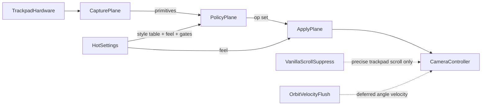

# System architecture

## End-user value

Players feel map-app-like trackpad control inside Cities: Skylines I without buying a mouse, while feel stays fully tunable. Optional Debug chrome can drive the same camera ops for tuning when Assist chrome is compiled on.

## Planes (target)

The rewrite splits work into three planes. Every tick walks them in order. No plane caches focus, menu, over-UI, selection, or camera pose across ticks — re-query each frame (state ownership).

```text
Capture (OS → primitives) → Policy (gates + session + style resolve) → Apply (feel math → camera / selection)
```

| Plane   | Responsibility                                                                                                                                                               |
| ------- | ---------------------------------------------------------------------------------------------------------------------------------------------------------------------------- |
| Capture | Platform backend fills one primitive/frame contract (honest finger count, centroid delta, pinch, rotate, modifiers). No pan/orbit/zoom decisions.                            |
| Policy  | Input gates, orbit latch / session, and **style binding table** resolve → camera / selection **op set**.                                                                     |
| Apply   | **Pure** feel math (Sensitivity, invert, deadzone when schema-backed) plus thin Cities adapters that write camera or place/relocate ghost. Pitch clamp is an apply constant. |

Feel Options and Debug are **not** a fourth tick plane. They are two hosts over **one feel catalog** and **one editor API** (preset dirty model, Sensitivity, autosave). [UI parity](../glossary/ui-parity.md) is the player-facing contract; the hosts must not each own a copy of the product ([ADR 0005](./adr/0005-ux-parity-not-source-parity.md)).



## Tick (contract)

1. Sync input gates (menu / Options, over popup, game focus) from live game state.
2. Connect or reconnect Capture if the mod is on and the city is ready.
3. Capture emits the current frame into the shared primitive contract.
4. Policy updates session (orbit latch, rotate-owned contact), then resolves primitives through the **style binding table** (Maps+ seed on ship) into an op set.
5. Apply consumes the op set with live feel; selection-aware rotate / orbit follow [selection-aware gestures](./selection-aware-gestures.md).
6. Harmony remains **narrow**: precise-trackpad scroll suppress buffers, and deferred orbit velocity flush after vanilla damp — see [vanilla camera suppress](./vanilla-camera-suppress.md). Do not use Harmony to cache policy inputs.

## Lifecycle

1. **Content Manager enable** — load settings, create runtime + default Capture source, apply Harmony patches (suppress + orbit flush only).
2. **City load** — boot focus; **arm** Capture for the loaded scene (independent of Debug UI).
3. **Simulation tick** — Capture → Policy → Apply as above.
4. **Debug UI** — optional; opening the panel does not gate Capture readiness.

## Modules and compile gates

CAD gesture style, Contacts capture, and Assist chrome stay behind positive `Enable*` **compile** symbols (default off). When a symbol is off, that module is **omitted from the ship DLL** — no stub UI, no tick-path no-op filters, no empty objects. See [feel profiles and product flags](./adr/0003-feel-profiles-and-product-flags.md) and [settings and hot configuration](./settings-and-hot-configuration.md).

## Constraints

- Prefer additive camera writes. Harmony is limited to precise-trackpad scroll suppress and orbit velocity flush while the mod is on.
- Do not own zoom-limit or saved-position features.
- Fail soft if Capture is missing or fails to start, and if Cities Harmony is missing (gestures may still apply; scroll fight or missing orbit flush may remain).
- Interpretation stays in Policy/Apply so feel and style seeds never require restarting Capture.
- One primitive/frame contract across Capture and Policy — no dual frame types or copy bridges (see [greenfield redesign lessons](./greenfield-redesign-lessons.md) L3).
- Do not implement planes or feel UI by copying shipping sources (L13).

## Open risks

- OS-reserved multi-finger gestures vs a future CAD three-finger orbit (only when that module is compiled on and Capture emits honest finger counts).
- Cities Harmony missing or failing to patch: two-finger pan may still overlap vanilla scroll-zoom; Option-orbit may not integrate.
- Backend ABI or driver differences across OS versions.
